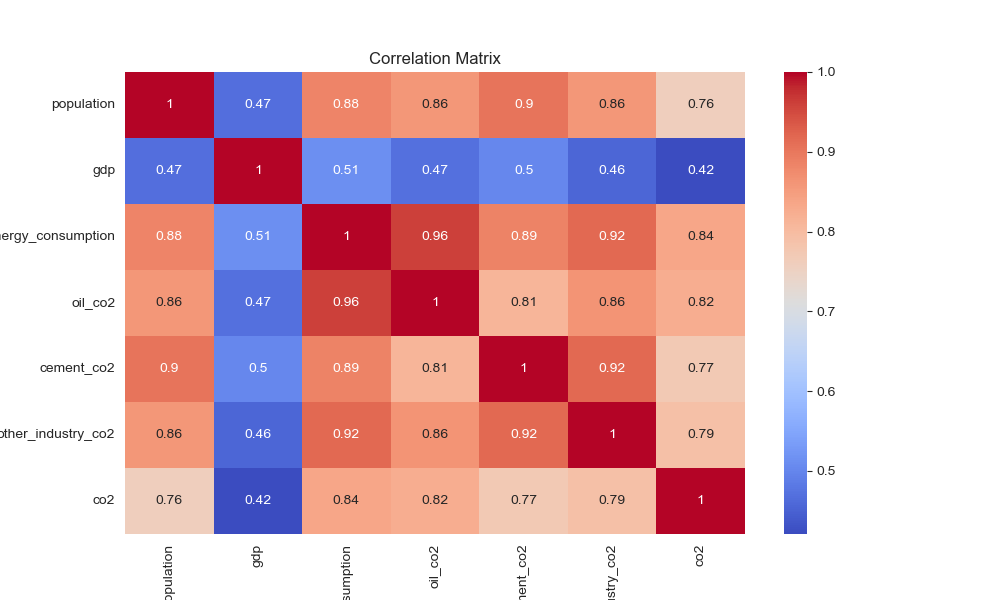
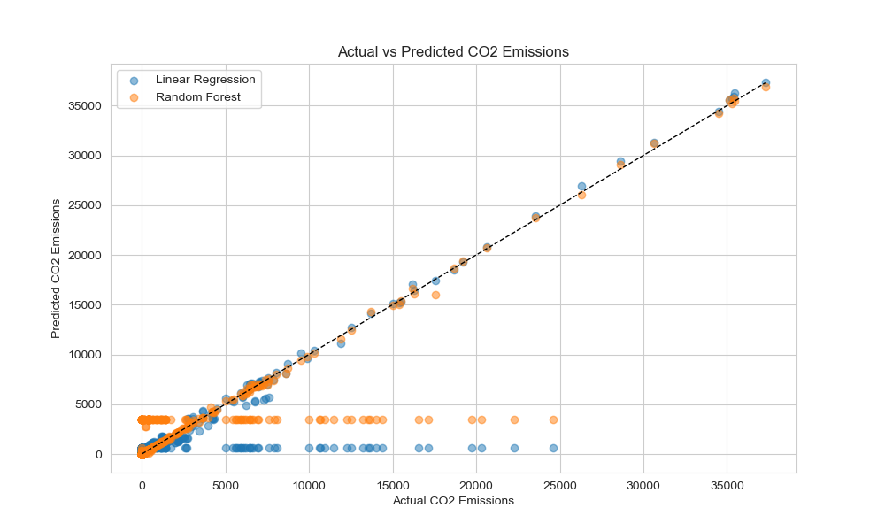
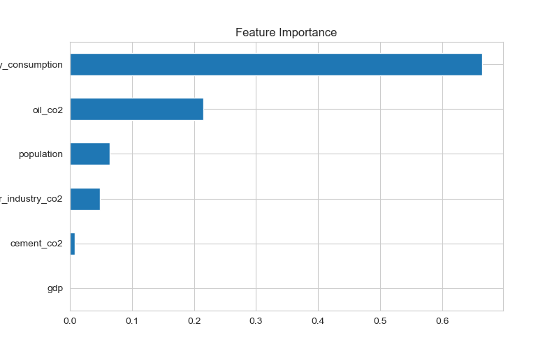

# SDG 13: CO2 Emissions Prediction

This project addresses **UN SDG 13: Climate Action** by predicting CO2 emissions using supervised learning (linear regression and random forest). The model uses features like population, GDP, and energy consumption to forecast emissions, helping policymakers prioritize climate interventions.

## Demo

## How to Run
1. Clone the repo: `git clone https://github.com/derrickngari/sdg13-co2-prediction.git`
2. Install dependencies: `pip install -r requirements.txt`
3. Run the notebook: `jupyter notebook co2_emission_prediction.ipynb`

## Dataset
- Source: [Our World Data co2-data](https://github.com/owid/co2-data/blob/master/owid-co2-data.csv)
- Features: population, gdp, primary_energy_consumption, oil_co2, cement_co2, other_industry_co2
- Target: co2 (ennisions in metric tons)

## Model Performance
- **Linear Regression**: MAE = 465.39 tons, R² = 0.7597 (75.97% variance explained).
- **Random Forest**: MAE = 332.04 tons, R² = 0.8142 (81.42% variance explained).
- Random Forest outperforms Linear Regression, providing more accurate predictions for CO2 emissions.

## Feature Importance
The Random Forest Regressor identified:
- `primary_energy_consumption`: 0.6648 (66.48%), the dominant driver of CO2 emissions.
- `oil_co2`: 0.2147 (21.47%), reflecting transport’s role.
- `population`: 0.0646 (6.46%), indicating demand impact.
- `other_industry_co2`: 0.0479 (4.79%), moderate industrial influence.
- `cement_co2`: 0.0078 (0.78%), minimal cement impact.
- `gdp`: 0.0003 (0.03%), negligible economic effect.
This suggests energy use and transport are key targets for emission reduction.

## Ethical Considerations
- Bias: Data may underrepresent low-income regions.
- Fairness: Model promotes equitable climate policies.